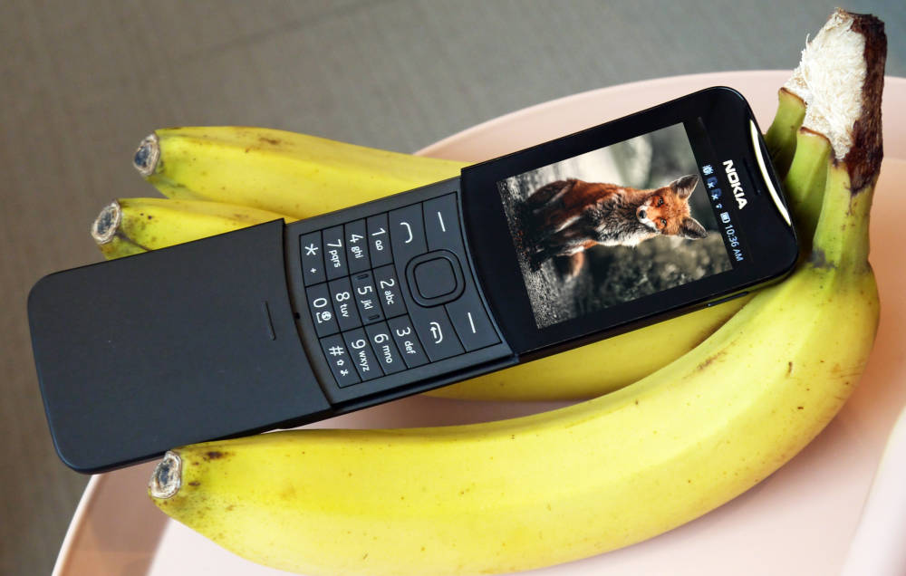

# Cow goes moo

A simple Nokia 8110 (KaiOS/GerdaOS) game created for my daughter to learn what does the animals says.



## How it works

Application simply shows animal pictures and plays the sounds of it. So children learn faster what does the animal says.


## How to install

The recommended route is using [Lux Ferre's GDeploy](https://gitlab.com/suborg/gdeploy). Check 

### Prerequisities

1) Install ADB
Follow instructions here https://www.xda-developers.com/install-adb-windows-macos-linux/

2) Clone and install [Lux Ferre's GDeploy](https://gitlab.com/suborg/gdeploy)
```
git clone https://gitlab.com/suborg/gdeploy.git

npm i & npm link
```


### Instalation

#### Build yourself

3) Clone this repository
```
git clone https://github.com/skooda/cowgoesmoo
```

4) Connect your phone using USB and check that is connected
```
adb devices
```

5a) For KaiOS install this app using Lux Ferre's GDeploy](https://gitlab.com/suborg/gdeploy)
```
gdeploy install cowgoesmoo/app
```

5b) For GerdaOs build the omniSD package first
```
make build
```

#### Use prebuilded

Alternatively you can use prebuilded [application](https://github.com/skooda/cowgoesmoo/raw/master/build/application.zip) or [gerdaOS](https://github.com/skooda/cowgoesmoo/raw/master/build/package.zip) package which located [here](https://github.com/skooda/cowgoesmoo/tree/master/build)

## Compatible phones

Nokia 8110 4G
Alcatel OT-4044
CAT B35
Jio Phone
Nokia 2720
Nokia 800
... and any other KaiOS or GerdaOS phone


## Credits

Images from [Unsplash](https://unsplash.com/):
- [Fox photo by Alexander Andrews](https://unsplash.com/photos/mEdKuPYJe1I)
- [Dog photo by Alvan Nee](https://unsplash.com/photos/eoqnr8ikwFE)
- [Cat photo by Manja Vitolic](https://unsplash.com/photos/gKXKBY-C-Dk)
- [Sheep photo by Benjamin Sander Bergum](https://unsplash.com/photos/Bpkdz8nkufU)
- [Bear photo by Anvesh Baru](https://unsplash.com/photos/2ZXrBR4ByAQ) 
- [Cow photo by Amber Kipp](https://unsplash.com/photos/Mm_D_kbvTUM)
- [Lion photo by Charl Durand](https://unsplash.com/photos/Sb7UlHaJGVk)
- [Pig photo by Laura Anderson](https://unsplash.com/photos/CP9GGy_LkIY)
- [Horse photo by Mat Reding](https://unsplash.com/photos/2s-_S0vAJJI)

Sounds from:
- [freesoundeffects.com](https://www.freesoundeffects.com)
- [orangefreesounds.com](http://www.orangefreesounds.com)
- [soundbible.com](https://www.soundbible.com)
- [fesliyanstudios.com](https://www.fesliyanstudios.com)

Icon from:
- [stockio.com](https://www.stockio.cz)
